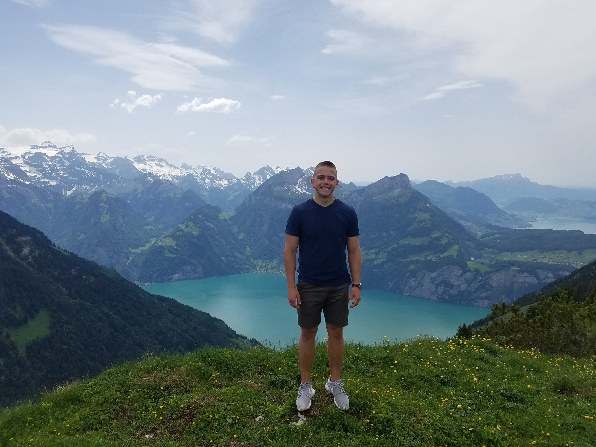

+++
categories = ["lug"]
date = "2019-10-08T17:00:00-04:00"
description = "Bradley Budden (bbudden)"
draft = false
tags = ["lug"]
title = "Bradley Budden (bbudden)"
toc = false

+++

<!--more-->

 
My name is Brad Budden. I am a current sophomore studying computer science at the University of Notre Dame. I'm not sure
exactly what field of computer science I will be most interested in, but I enjoy learning about linux and have fun with embedded systems programming for arduinos. 
 
 
Last summer, I studied abroad in Rome, taking classes in quantum engineering and visual programming. I and was able to travel all over Italy and to Greece, Switzerland, and Sweden
 
 
Next spring I hope to participate in the Notre Dame Silicon Valley Semester, a
program offered by ND out in the valley for students looking to take relevant courses and work at local companies/startups.
 
 
Apart from my computer science related coursework and ND LUG, I like to play basketball and workout. I also occasionally enjoy playing a few video games. 
 
 

    

 

*This is me hiking in Switzerland!*

 
