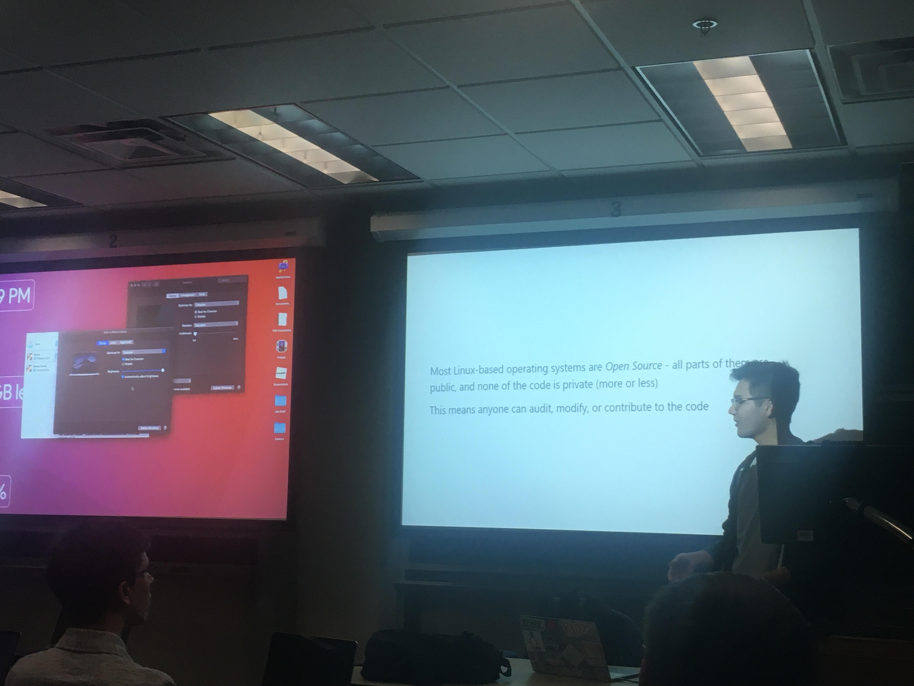
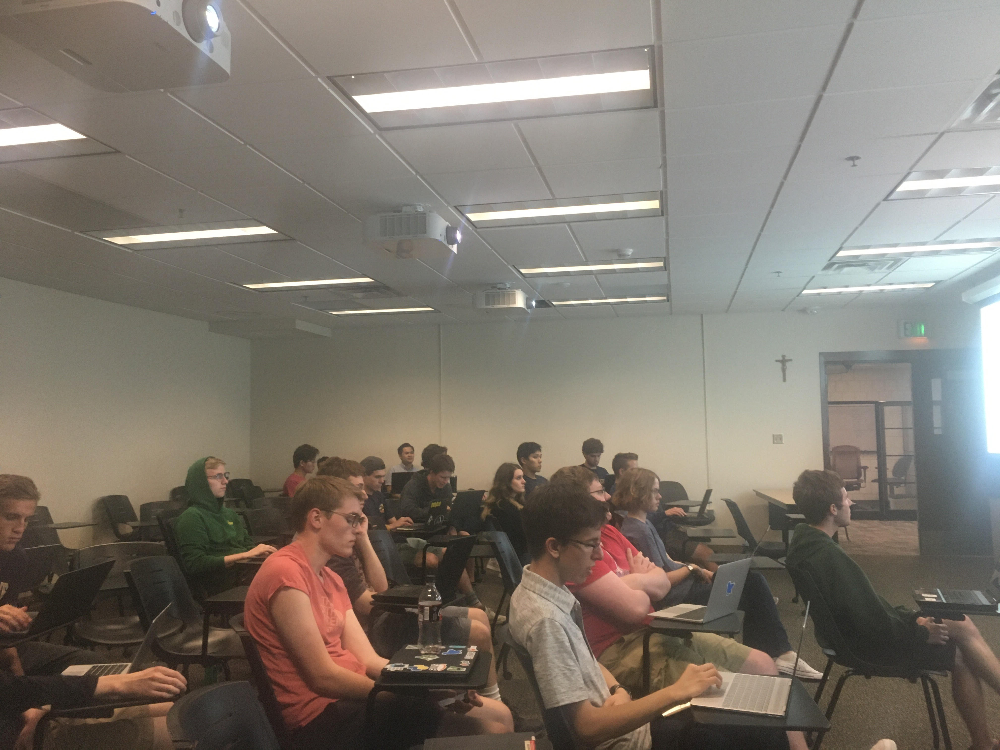

+++
categories = ["lug"]
date = "2019-09-22T17:00:00-04:00"
description = "Intro to Linux Meeting"
draft = false
tags = ["lug"]
title = "Intro to Linux"
toc = false

+++

Senior officer Noah Yoshida helps some Linux newcomers set up and get comfortable with the operating system.

<!--more-->

## VM Performance Improvements

To start the meeting, Logan gave some quick tips and tricks for those who had recently installed Linux via a virtual machine.
He suggested that users increase the amount of system RAM and CPU power that the virtual machine can use. He also showed
some VirtualBox specific settings.

 

 
*Logan shows off the settings to change to improve a virtual machine.*

## Intro to Linux and Customization

Noah started off with a brief introduction to Linux, with some specifics as to what Linux really is. He spoke to the fact
that Linux is open-source, which means that anyone can contribute! Noah helped those with fresh installs set up internet.
He next helped get some applications installed on new installs. He introduced the group to the Ubuntu application store,
and showed how similar it is to the application stores people are more familiar with. He then introduced the more advanced
method of installing applications via the command line using apt. Check out his slides below to see what else Noah covered!
After his talk, many members of LUG stayed after to help newer members with questions they had and show them new commands,
tips, and tricks!
 
 

 
*Noah goes introduces Linux and customization to the group*

## Noah's Slides



### Thanks to all those who stopped by!

