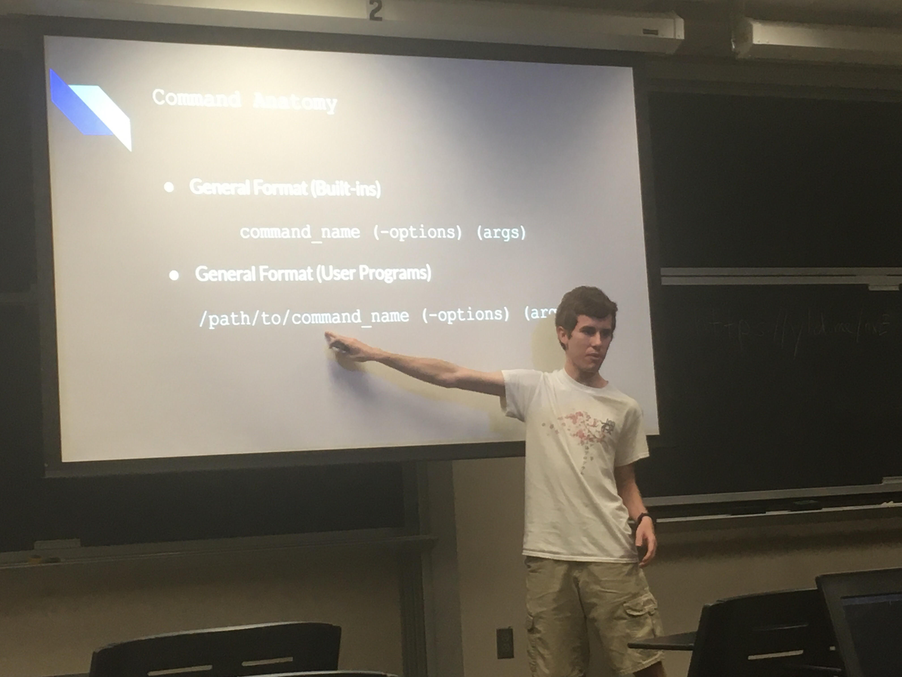
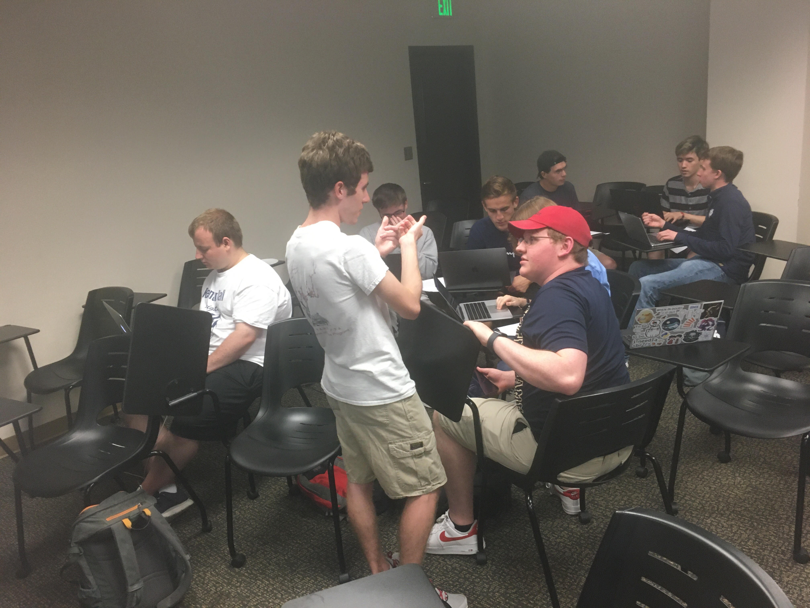
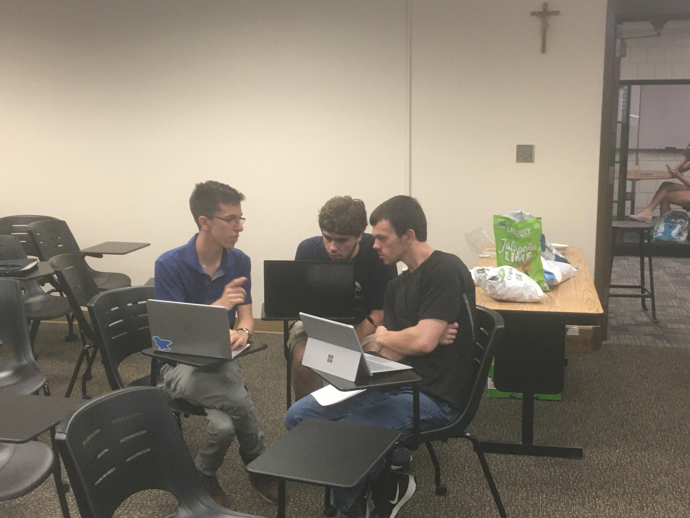

+++
categories = ["lug", "command line"]
date = "2019-10-01T17:00:00-04:00"
description = "A lecture by Logan, followed by a group command line adventure."
draft = false
tags = ["lug", "command line"]
title = "Intro to the Command Line"
toc = false

+++

Logan talks about the command line, and officers guide a command line adventure.

<!--more-->

## Intro

 
*Logan gives an introduction to the command line.*
 
 

Logan started off this week's meeting with an overview of the command line. He mentioned the terminal itself and the idea
behind it, file structure from the perspective of the terminal, file permissions, and some common commands. He also
brought up an essential facet of the command line: the Unix Philosophy.
 
 
"What is the Unix Philosophy?", you might ask.

1. Write programs that do one thing and do it well.
2. Write programs that work well with each other.
3. Write programs that handle text streams, because that is a universal interface.

Logan also briefly discussed more advanced techniques such as piping and i/o redirection. Check out Logan's slides below!
 
 



 

## Adventure

 
*Two groups discuss approaches to the command line adventure's challenges.*
 
 

After Logan's talk, attendees split up into groups to do a "command line adventure", a series of challenges to be completed
on our server, Appa. Each group worked together to complete the challenges using the information provided by Logan's talk
and a "cheatsheet" of common commands. Challenges included things like changing permissions on a file, finding patterns
of text in files, and searching the filesystem for files of a specific name.

 

Check out the command line adventure on our [GitHub](https://github.com/NDLUG/command-line-adventure).
 
 

 
*Zephan helps out some newer members of LUG with the command line adventure.*
 

## Hacktoberfest Next Week

Next week, our meeting will focus on Hacktoberfest, a Digital Ocean event that encourages contribution to open source. We will be
helping members make contributions in the hopes that most (if not all) attendees have completed a pull request by the end of the meeting!

 
