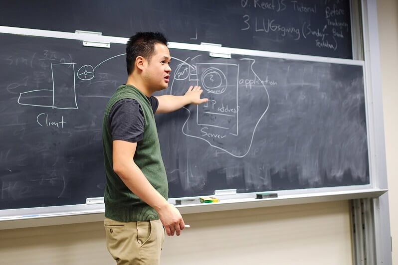
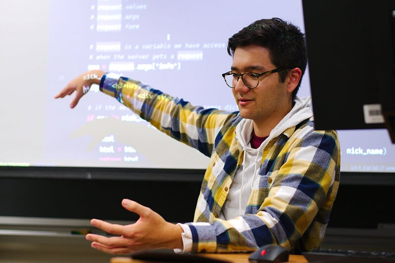

+++
categories = ["lug", "python", "flask", "hackathon"]
date = "2019-11-11T17:00:00-04:00"
description = "Professor Bui and Noah speak about Web Dev and Python's Flask"
draft = false
tags = ["lug", "python", "flask", "hackathon"]
title = "Flask Tutorial/Hackathon Prep"
toc = false

+++

Professor Bui and Noah speak about Web Dev and Python's Flask

<!--more-->

## Intro to HTTP

 
*Professor Bui gives a bried introduction about HTTP*
 
 

The purpose of this meeting was to give members a starting point heading into
the weekend's hackathon, IrishHacks.
Professor Bui began last week's meeting with an intro to HTTP. He drew a diagram
of client-server interaction and described some of the higher level concepts
of the protocol.

## Intro to Flask

 
*Noah goes over an example python web application using Flask*
 
 

After Professor Bui's intro to HTTP, our treasurer, Noah Yoshida, presented on
Flask, a python package for building web applications. Noah tied his examples in
nicely with Professor Bui's overview of HTTP by showing how Flask routes HTTP
requests to resources and returns content to a user based on these paths.

Noah's example code can be found on our [GitHub page](https://github.com/NDLUG/tutorials).

## Irish Hacks

We were happy to see a lot of NDLUG hackers at the hackathon this past weekend.
These events are a great place to showcase skills or to learn something new. We
hope to see many more LUG members at the hackathon in the spring!

