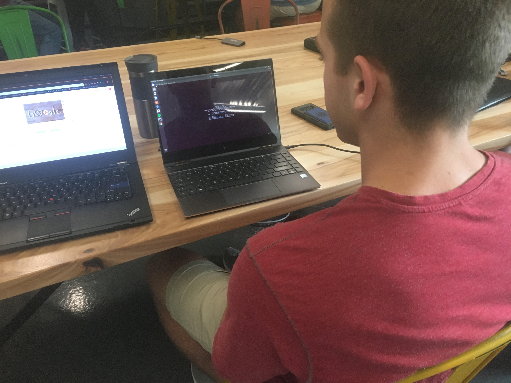
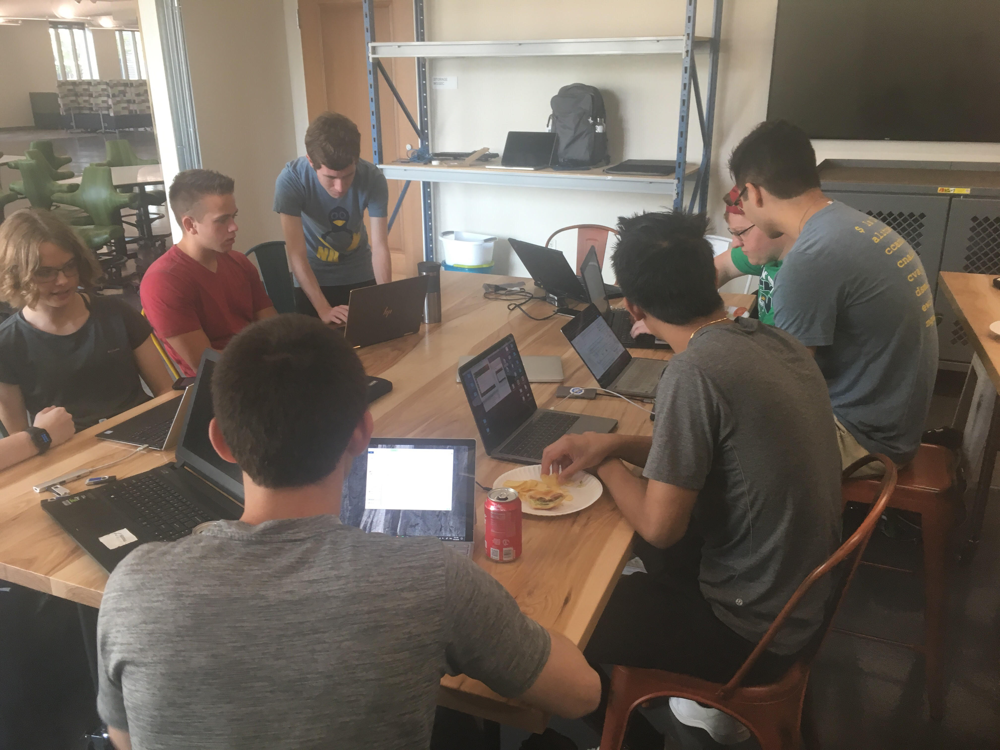
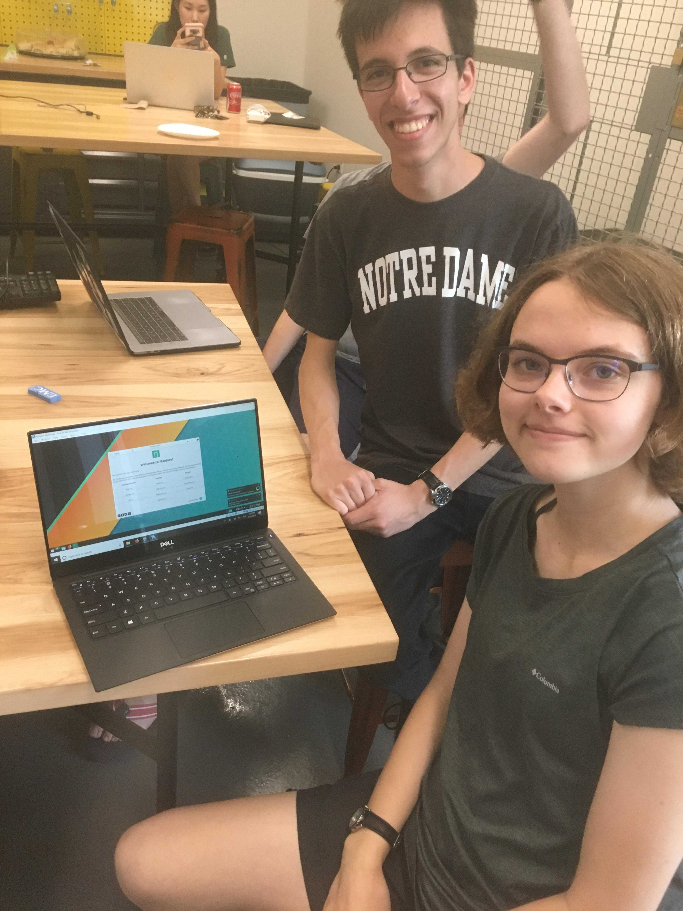
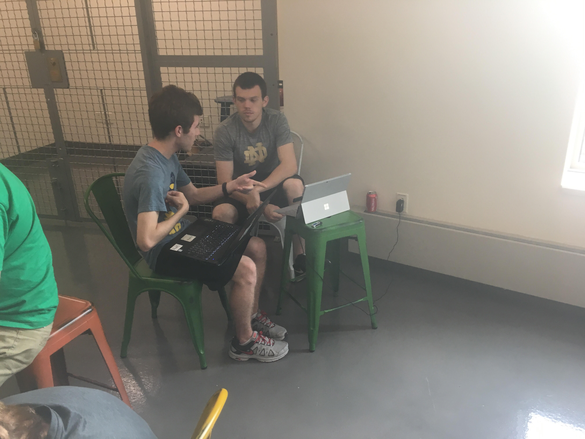

+++
categories = ["lug", "installfest"]
date = "2019-09-21T17:00:00-04:00"
description = "2019 Installfest"
draft = false
tags = ["lug", "installfest"]
title = "2019 Installfest"
toc = false

+++

Success stories from this weekend's Installfest, brought to you by LUG.

<!--more-->

## Recap

Thanks to everyone who could make it to this weekend's Installfest! We had a solid turnout, with about a dozen students looking to install
Linux in one way, shape, or form (VM, dualboot). A few upperclassmen LUG members also showed up to help out - thanks to you as well! Besides
the usual Windows headaches, Installfest was smooth sailing. For the most part, every LUG member who arrived in the hopes of installing
Linux was able to successfully do so. The main distribution that students were able to install was [Ubuntu 18.04](http://releases.ubuntu.com/18.04/). One LUG member tried her
hand at [Manjaro](https://manjaro.org) on a Virtual Machine and said she hopes to do a full installation on one of her older laptops. We hope everyone
likes their new installs!

### Thanks to all those who stopped by!

 
*LUG Sophomore Brad with his successful dualboot of Ubuntu 18.04*
 
 

 
*Officers Logan Yokum, Michael Eisemann, and Noah Yoshida help everyone prepare to install.*
 
 

 
*LUG Freshman Catherine pictured with her Manjaro VM and Junior Zephan Enciso.*
 
 

 
*Our president Logan discusses his experience with dualbooting Windows and Linux with LUG member Zach.*
 
 
