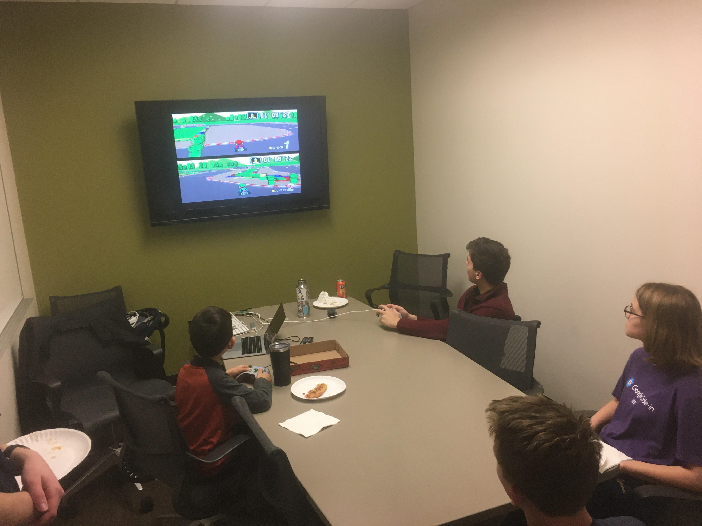
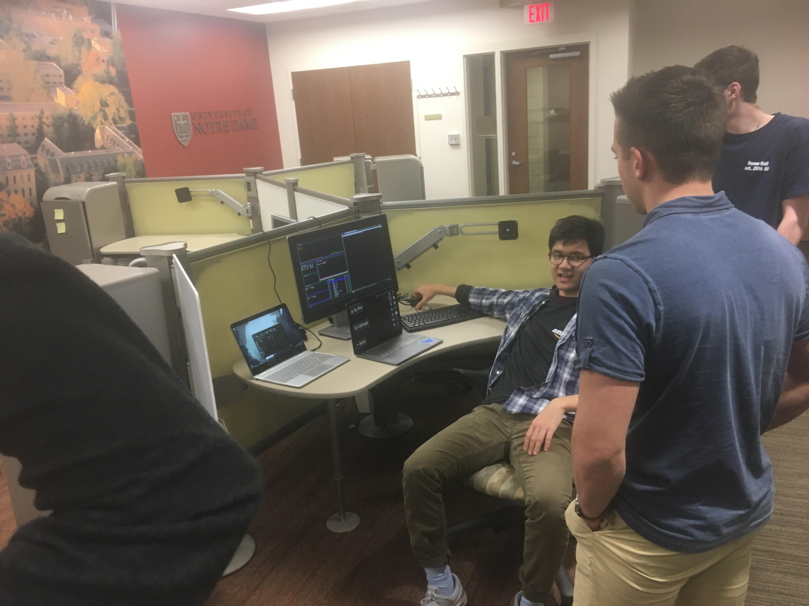
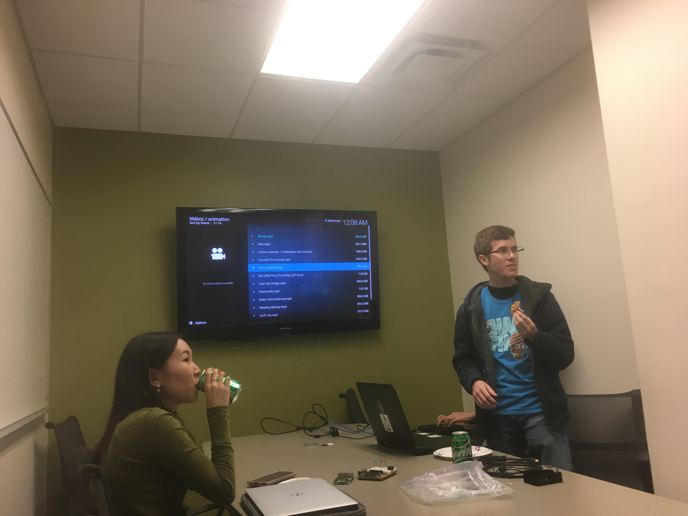

+++
categories = ["lug", "raspberry pi"]
date = "2019-11-19T17:00:00-04:00"
description = "LUG members show off Raspberry Pi projects"
draft = false
tags = ["lug", "raspberry pi"]
title = "Raspberry Pi Showcase"
toc = false

+++

LUG members show off some Raspberry Pi projects.

<!--more-->

## Retro Pi

 
*LUG members battle it out in Super Mario Kart via a SNES emulator running on a Raspberry Pi.*
 
 

One of the projects brought to this week's meeting was a Raspberry Pi running [RetroPie](https://retropie.org.uk/). RetroPie is a project that runs on top of [Raspbian](https://www.raspberrypi.org/downloads/raspbian/), a linux distribution
made for Raspberry Pi's based on Debian Linux. It can be installed on an existing Raspbian installation.

 

RetroPie allows you to turn your Raspberry Pi into a classic game emulator. It can emulate NES, SNES, Gameboy Advance, and more. All you have to do is download ROMs of the games you want to play to the appropriate folder on the Raspberry Pi, and voila! - you
can fulfill that nostalgic desire to play Super Mario Bros 4.

## Samba Server

 
*Noah shows off some of the capabilities of a Samba server to other members of LUG.*
 
 

Another project on display at this week's meeting was a [Samba Server](http://www.linuxandubuntu.com/home/what-is-samba-server-and-how-to-setup-samba-server-in-ubuntu-linux). A Samba Server is an open-source server with its own protocol that allows it to communicate with Windows devices as a native application. It offers services for files and printing, among other things, which is the service we used in conjunction with Kodi.

## Kodi Media Center

 
*Logan shows the configuration settings in Kodi.*
 
 

[Kodi](https://kodi.tv/) is an open source project for streaming media. It can be used in conjunction with a Samba Server to stream media. Basically, the
Samba Server hosts and serves files, such as movies. Then, in Kodi, one can configure the application to use a shared folder on the Samba Server, giving
access to the server's movies, pictures, etc. This seems to be a great alternative to a Roku or even Chromecast.

 
While the blog writer was unable to snag a picture of the movie Moana streaming via Kodi, trust me - it happened :)

 

Thanks to everyone who brought a project in this week, and thanks to those who came to the showcase! This Sunday will be LUGsgiving, we hope to see
a good turnout!

 
