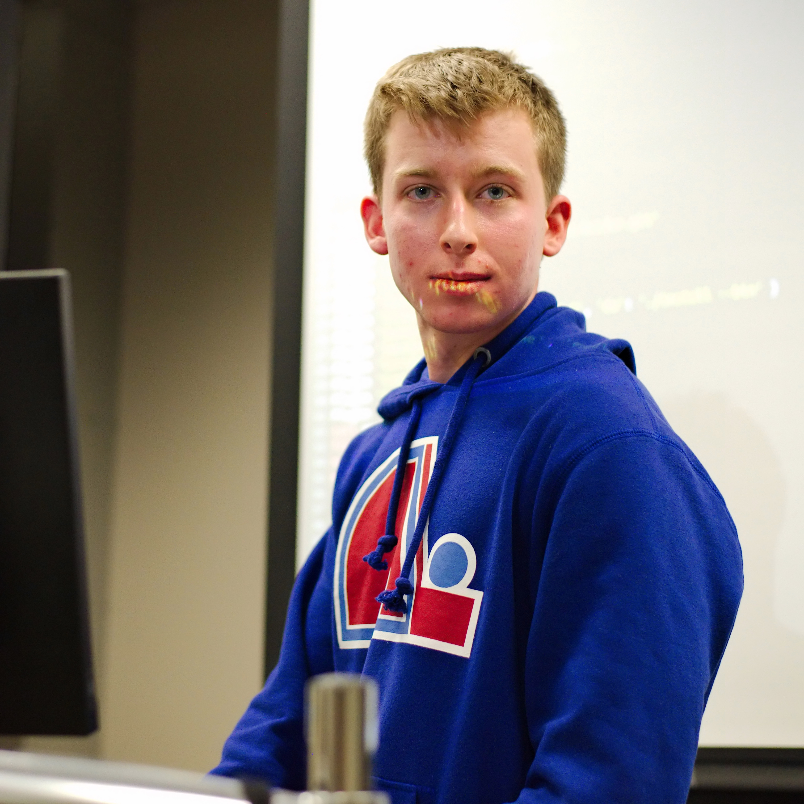
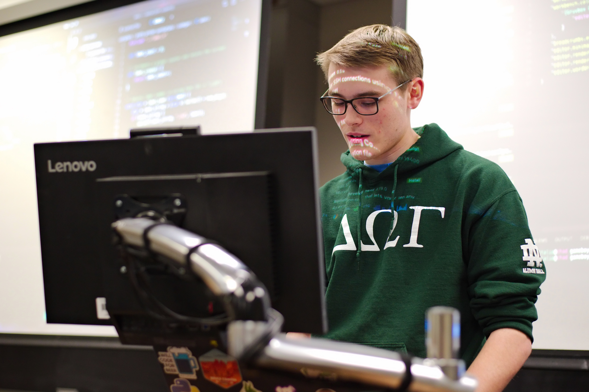
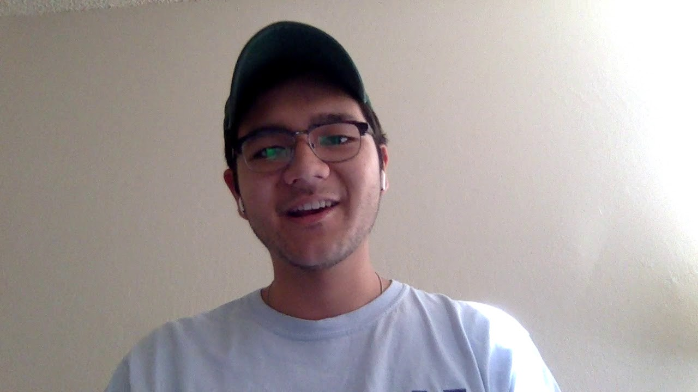

+++
categories = ["lug", "text editors", "ide"]
date = "2020-1-29T17:00:00-04:00"
description = "LUG members share and learn about text editors"
draft = false
tags = ["lug", "text editors", "ide"]
title = "Text Editors in the Field"
toc = false

+++

LUG members share and learn about text editors.

<!--more-->

## Emacs / Spacemacs

 
*LUG member and graduate student William "Bill" Theisen showing off emacs*
 
 

The first text editor shown during the meeting was Emacs, shown by avid LUG member and graduate student William "Bill" Theisen.
[Emacs](https://www.gnu.org/s/emacs/) or [spacemacs](https://www.spacemacs.org) as Bill uses, is a truly open 
source editor from the 1970s. The club could really see Bill's enthusiasm for the editor!
He shared all of the cool features like its extensibility, org-mode, and even Tetris!

 

Spacemacs is an emacs "distro", which has Vim keybindings (which Bill claims as superior) and is fully community-driven.
"Notice I can click on this with my mouse..." says Bill Theisen sharing one of his *Key* selling points.
From writing class notes in org-mode to evaluating python code like a jupyter notebook, Bill described the
optimal way to take in class notes.

 

He ended his presentation saying "I mostly just use vim...".

## Vim

 
*Ben shares his superior text editor*
 
 

Ben shared his favorite editor, Vim. With BUILT IN vim keybindings, and no need to even use the mouse, vim really outpaces its competitors.
He showed basic commands and the built in Vim tutor to show its ease.
He even showed us how to exit vim!
Ben went on to explain the extensibility of vim with its Plugin system, and the vimrc configuration file.

## VSCode

 
*Sam shows off VSCode*
 
 

Sam showed off VSCode. He talked about its extensibility, ease of use, and ssh-ability.
He showed off how easy it is to make it work just like your favorite editor, but in VSCode.
Further, he talked about git (with help from Zephan) and how it is built in to VSCode from the start.
He even shilled a telemtry free version of VSCode called VSCodium!

## Atom

 
*Julius teaches about Atom*
 
 

Julius showed off Atom. Sharing the quick flight manual, plugins, and general usability of the IDE, he made a very good case for it! If you are craving something simple, atom is the place for you!

## Pycharm

 
*Noah shills PyCharm (NOT PICTURED, here is a picture of Noah from our [YOUTUBE CHANNEL](https://www.youtube.com/channel/UCgjD_i0PrkKerzrN9OsheWg)*
 
 

Noah told us about Jetbrain's python IDE, PyCharm. This IDE has every bell & whistle fully imaginable.
"It pretty much writes every line of code for you", said Noah as he describe how this is an industry standard and used by many companies.
This IDE actually tries to read your code and give you very good information on your code and empowers refactors.

 

Thanks for everyone who came this week, we had a great turnout! Hopefully everyone learned something,
and might even consider trying out a new editor!
