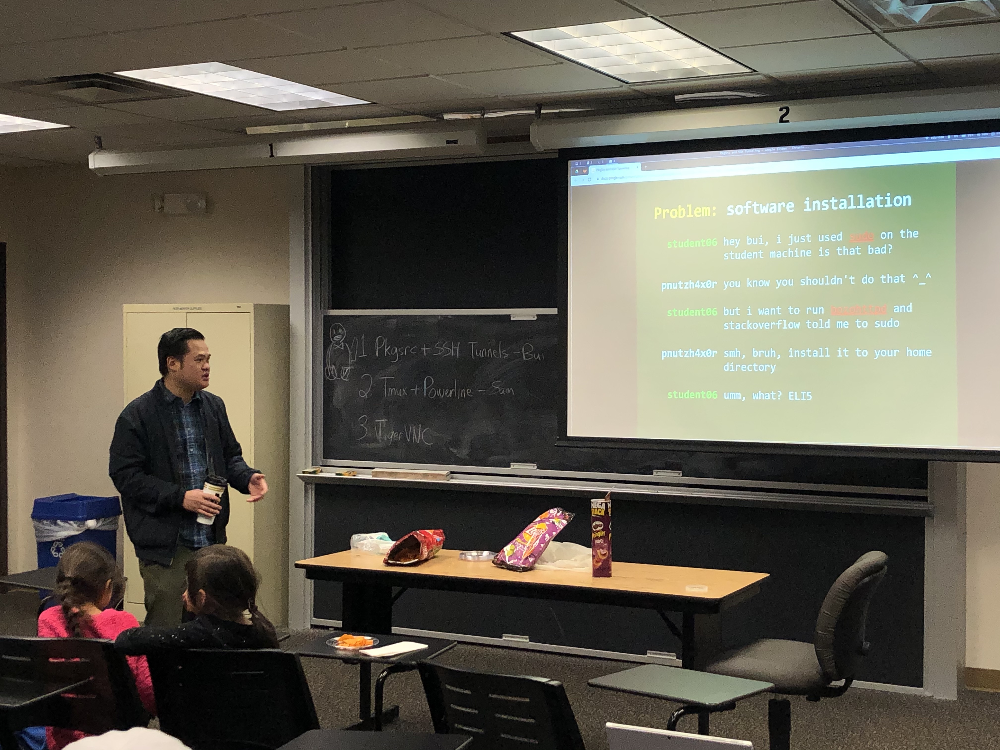
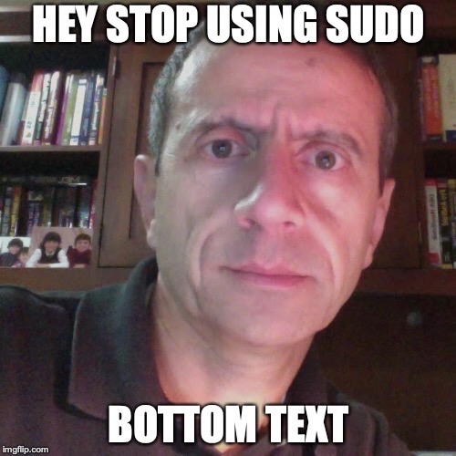
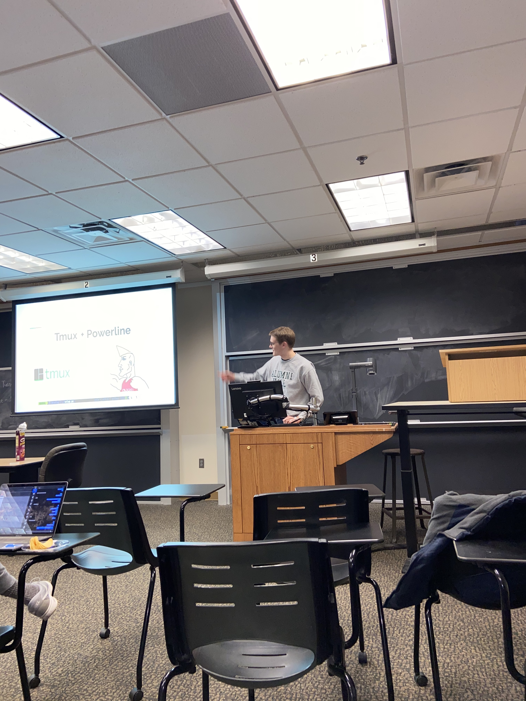
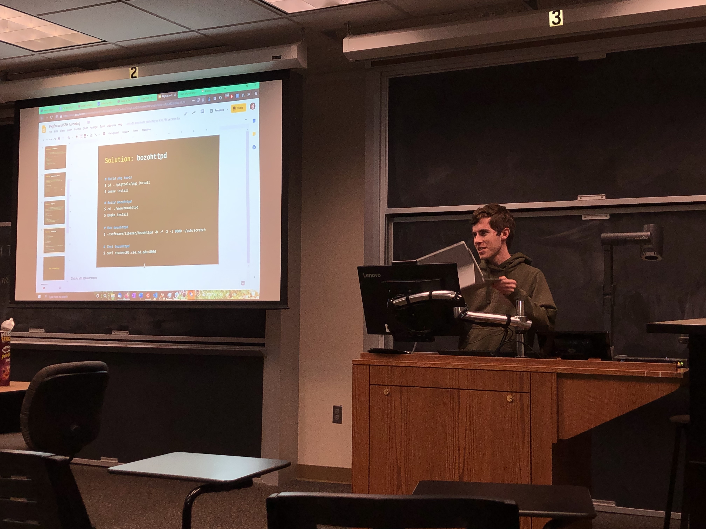

+++
categories = ["lug", "remote computing"]
date = "2020-02-05T17:00:00-04:00"
description = "LUG members learn about Remote Computing!"
draft = false
tags = ["lug", "tmux", "tigervnc", "remote computing", "ssh", "ssh tunneling"]
title = "Practical Applications of Tmux + Remote Computing"
toc = false

+++

Lug members learn about Remote Computing in a variety of applied concepts.

<!--more-->

## Pkgsrc + SSH

 
*Professor Bui explains how to avoid having to use sudo on stuent machines*
 
 

The first thing we talked about at the meeting was Pkgsrc + SSH. Professor Bui explained a way to use autotools to
avoid the need to use sudo on the student machines. How useful and powerful!
Most software packages use some variant of autotools, and you basically build/install the program yourself.

He demonstrated this with cmatrix, with isn't installed on the student machines.

He went further and described pkgsrc, which saves you from "dependency hell".

 

pkgsrc is a framework for building third-party software on NetBSD and other UNIX-like systems.

By simple setting it up with the right flags, you can run it without using the *sudo* command. (Ramzi approved!)

  

 
*Dont use Sudo*
 
 

With this powerful tool, we can download and use all sorts of things like webserver too!

He then went on to explain SSH tunneling, to help use ssh to "tunnel" traffic through the firewall. 
Pretty elite hacking if you ask me.

[LINK TO SLIDES](https://docs.google.com/presentation/d/1vAtcDuIa3bALbRpOe4auCTv5gB-GAZi5iihqfm69Wcs/edit?usp=sharing)

## Tmux + Powerline

 
*Sam flexes his brain with Tmux*
 
 

Sam talked about Tmux and powerline. He explained the use cases of tmux and its prowess in remote computing.
Describing use cases, he demonstrated the persistance of the sessions throughout ssh connections and cool
configurations. 

He also spoke about powerline, which is a nice style addition to Tmux. It adds a far nicer looking customizable
status bar to the bottom of the tmux session.

[LINK TO SLIDES](https://docs.google.com/presentation/d/1wnaSwvEPdhpqzo2qEA60hcivQYTzKm_MQVM-netwCAQ/edit?usp=sharing)

## TigerVNC + Web registration on campus

 
*Logan shows off TigerVNC*
 
 

[TigerVNC](https://tigervnc.org) is a open source remote desktop tool. Logan (President Yokum) demonstrated how to set this up so you can
use your more powerful computer on the go! This allows you to fully remote access other machines with no paywall.

 

Further, he talked about using webreg.nd.edu to give you your own little domain on campus.
This is a great way to have a flashier way to connect to your computer/server than some garbage of numbers and
dots.

 

Thanks to everyone who came, I had a great time sharing tmux and hearing the other presentations!
As always, if you have any questions or suggestions slack or email us!

Sam
 
