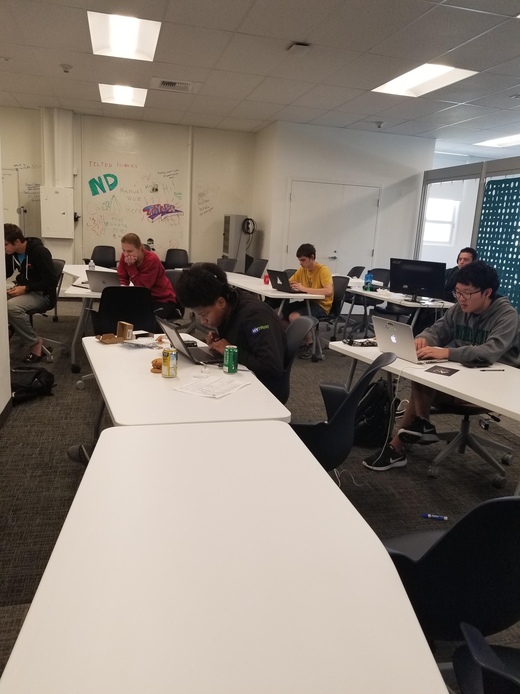
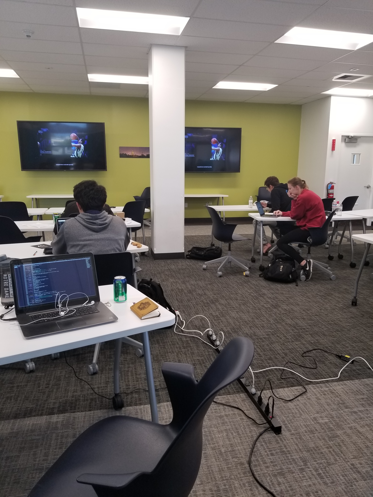

+++
categories = ["lug"]
date = "2018-03-18T14:09:20-04:00"
description = "NDLUG in Silicon Valley"
draft = false
tags = ["lug svs"]
title = "World Create Day"
toc = false

+++

<!--more-->

The Silicon Valley Semester chapter of the Notre Dame Linux User's Group participated in World Create Day 2018. We got together for a global day of hacking in community. Each participant came in with either a working project, an idea for a new project, or just their creativity and an open mind. We had an alumni mentor (David Mattia '17) join us and give us tips on our projects. Whether it was on a linux machine, a mac, an arduino or a raspberry pi, everyone got to mess around with something interesting.

- Cami Carballo ('19), LUG Treasurer

