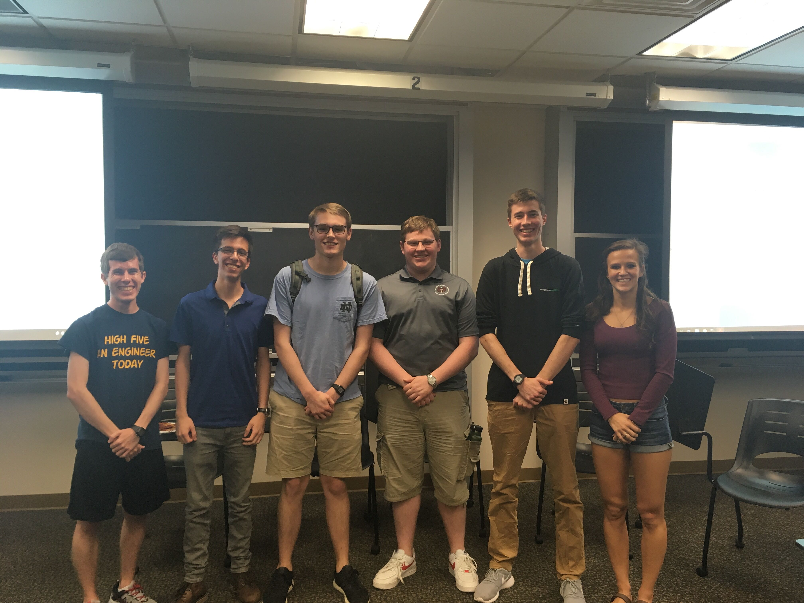

+++
categories = ["lug"]
date = "2019-09-10T17:00:00-04:00"
description = "2019 Internship Panel"
draft = false
tags = ["lug, internship"]
title = "2019 Internship Panel"
toc = false

+++

Kicking off this year's LUG with introductions, background about the club,
and a panel of upperclassmen who shared their summer internship experiences.

<!--more-->

## Welcome to LUG!

President Logan Yokum started our very first meeting of the 2019-2020 school year
with an introduction to LUG, the LUG officers, what we stand for, and what we have
planned for the next few weeks. Check out Logan's slides below! Other than this
evening's internship panel, LUG has a few events on the horizon:

1. <b>InstallFest</b> (Sat Sept. 21 11:30am-2:30pm, Innovation Lounge) - Come join LUG as we help beginners install Linux!
Any experience level welcome. More details in the slides below.

2. <b>Intro to Linux</b> (Tues Sept. 24) - LUG will be hosting a workshop to help beginners
get acclimated to the Linux environment.

3. <b>NDLUG Mini-Hackathon</b> (Late October) - More details to come.

4. <b>3D Printing with Blender</b> (TBD) - More details to come.

## Internship Panel

Our panelists, from left to right:

| Panelist | Company | Title |
|-----|-----|----|
| Logan Yokum (Moderator) | Amazon Japan | Software Development Intern |
| Zephan Enciso | Intel | Hardware Engineering Intern |
| Sam Battalio | Trek10 | Cloud Engineering Intern |
| Mike Eisemann | NSA | Information Assurance Intern |
| Gavin Inglis | Accenture | Application Engineering Analyst Intern |
| Katie Liebscher | Ubisoft (Red Storm Entertainment)| Gameplay Engineering Intern |

 
 
We also had some questions answered by our Treasurer, Noah Yoshida, who spent last
summer with Amazon, and Professor Peter Bui, CSE Faculty and NDLUG advisor.

 

Our panelists were able to provide our underclassmen attendees with advice on talking
to recruiters, insight into internships in varying industries, and tips on making yourself
stand out with personal projects and achievements. The panelists made an effort to
mention how they either used or contributed to open-source software projects and tools
during their internships.

 

The panel was a great success - those in attendence asked terrific questions, and our
panelists provided great advice and insight. <b>Thank you to the panelists for joining,
and thanks to all who could make it</b>! If you have more questions, please feel free
to email us or reach out on Slack (nd-cse.slack.com #lug).

 

Don't forget to join us next <b>Saturday, September 24</b> for <b>InstallFest</b> in the <b>Innovation Lounge Garage</b>!
Hope to see you then!

 



