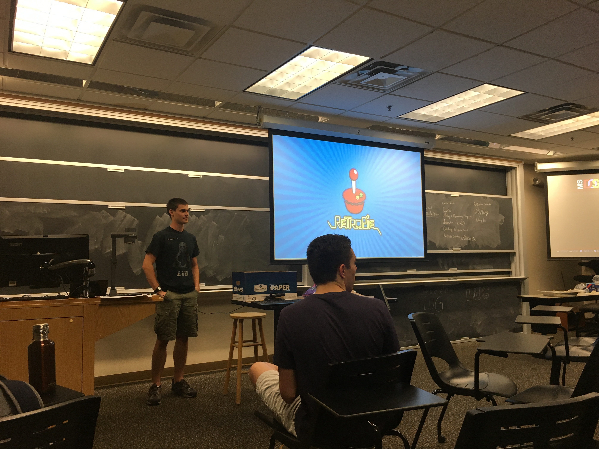

+++
title = "Starting the 2018 Fall Semester"
description = "NDLUG Meeting 08/30/2018"
draft = false
toc = false
categories = ["lug"]
tags = ["meeting", "2018"]
date = "2018-09-03T09:30:00-04:00"
+++

The first meeting of NDLUG in the Fall 2018 Semester.

<!--more-->

We kick off the Fall 2018 semester with cake, new members brainstorming new ideas for talks and events in the upcoming months, and a demo from sysadmin Doug Smith about retrofitting a Rasberry Pi to play all your favorite childhood games.

## Slides for Retropie



## Helpful Links

[Slack](https://nd-cse.slack.com)

[Retropie](https://retropie.org.uk)

[Rasberry Pi](https://www.raspberrypi.org)
